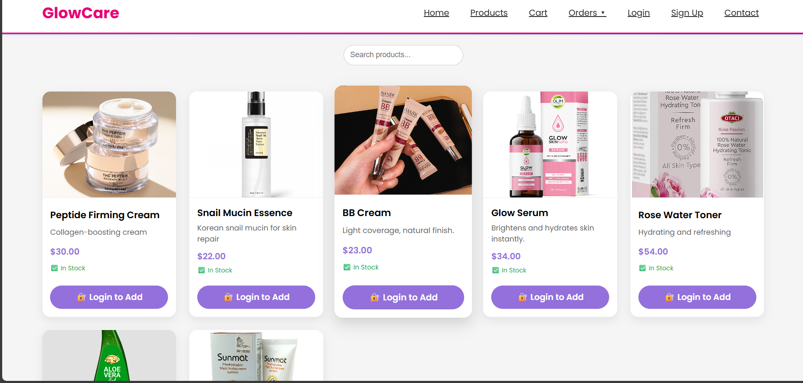
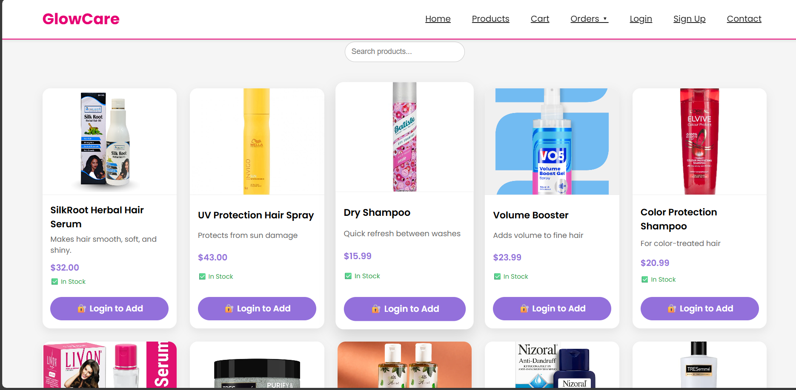
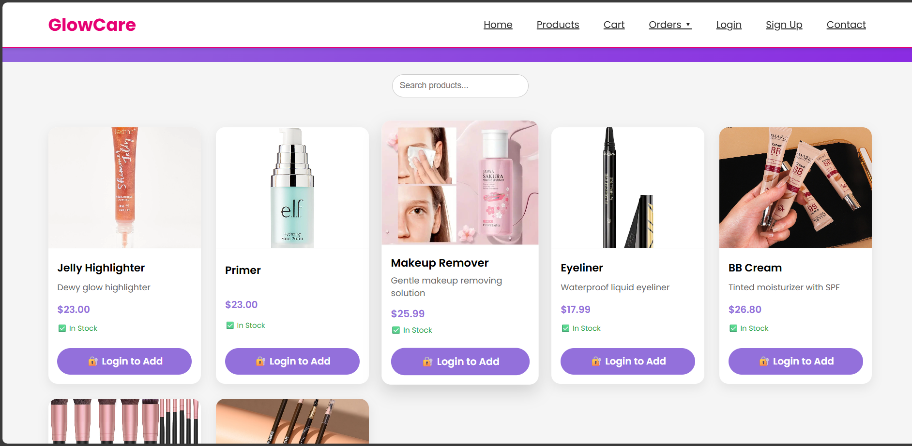
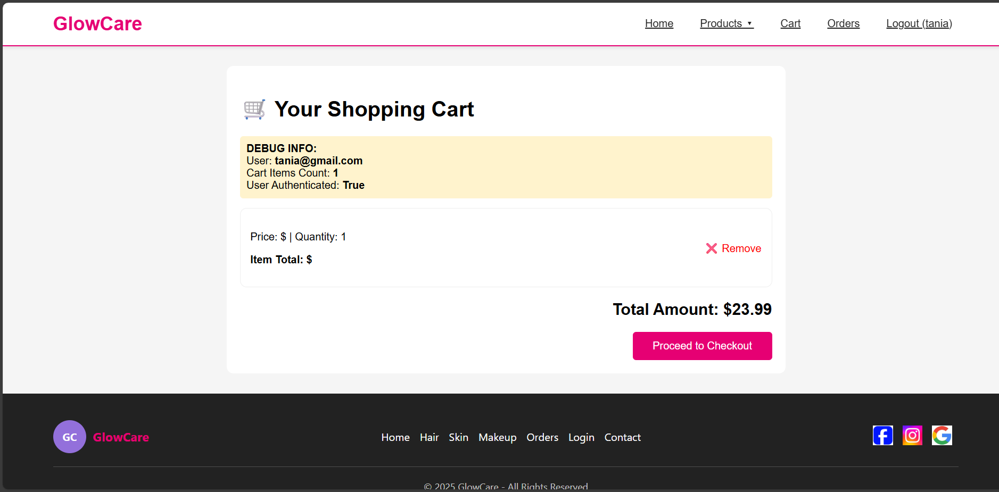
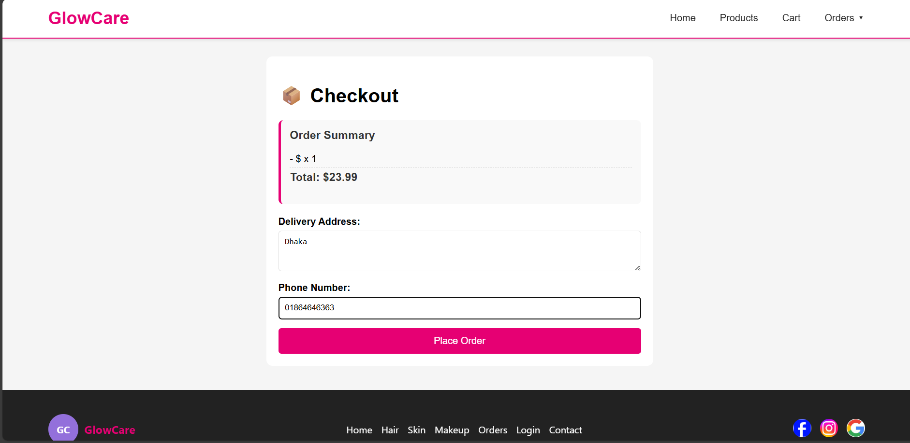
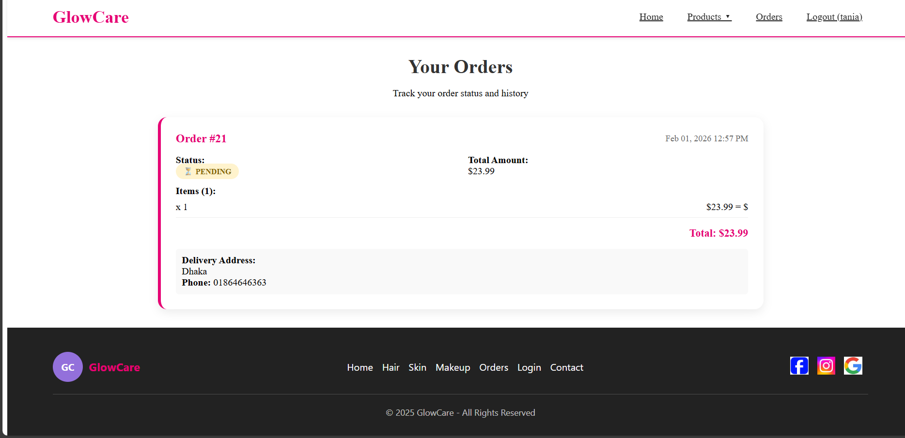
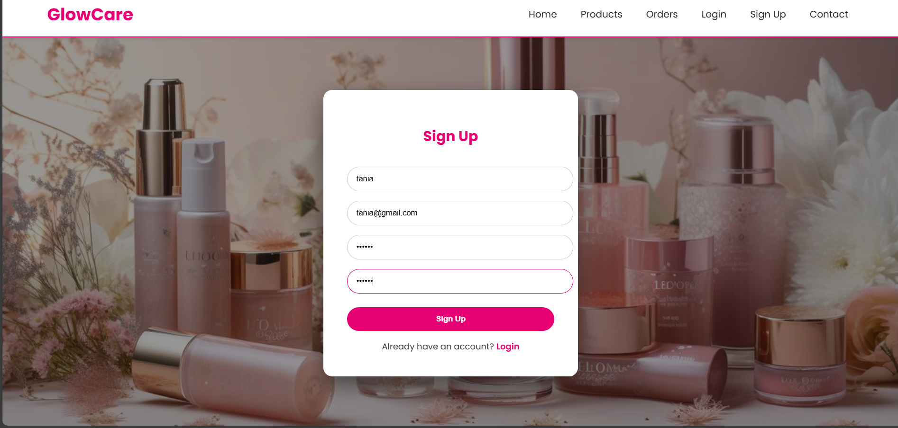
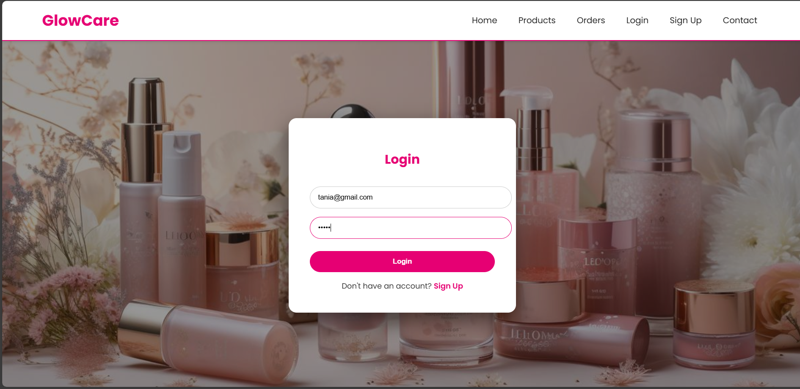

# MyGlowCare - E-commerce Platform for Skin , Hair Care & MakeUp🧴✨

**MyGlowCare** is a robust e-commerce web application built using **Django**. It is designed to help users browse, filter, and purchase skincare and haircareand makeup  products based on their specific needs. This project was developed as part of the **Database Management Systems** course (4th Semester).

---

## 🖥️ Project Screenshots (Visual Demo)

Below are the visual highlights of the application's interface:

### 🏠 Home Page


### 📊 Admin Dashboard & Data Management


### 🛍️ Product Categories (Skin, Hair & Makeup)




### 🛒 Shopping Experience




### 🔐 User Engagement




---

## 🚀 Key Features

* **User Authentication:** Secure Sign-up, Login, and Profile management for customers.
* **Dynamic Categorization:** Advanced filtering for Skin, Hair, and Makeup categories based on database queries.
* **Comprehensive Shopping Cart:** Users can add/remove products, manage quantities, and see real-time updates.
* **Admin Control:** Powerful dashboard to manage inventory, monitor orders, and handle user database.
* **Contact & Support:** Built-in contact form and "About Me" section for better user interaction.
* **Database Efficiency:** Optimized queries to handle product listings and user activities smoothly.

---

## 🛠️ Technology Stack

* **Backend:** Python (Django Web Framework)
* **Frontend:** HTML5, CSS3, JavaScript (Bootstrap for Responsive Design)
* **Database:** MySql (Relational Database Management)
* **Tools:** Git & GitHub for Version Control

---

## ⚙️ How to Run Locally

To get a local copy up and running, follow these steps:

1. **Clone the repository:**
   ```bash
   git clone [https://github.com/taniajannat12/Database-Management-systems-Project.git](https://github.com/taniajannat12/Database-Management-systems-Project.git)

Devloped By:
Jannatul Ferdous Tania 
( Department of Computer Science & Engineering )
Database Management Systems Project
